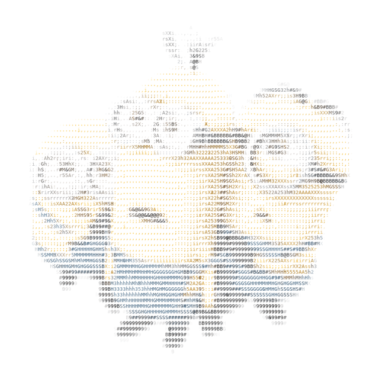

# ASCII Profile Generator

Export ASCII art as script-free animated SVG, PNG, JPEG, or GIF.

The goal is simple: install Python, run the setup, choose your settings, and get the file you asked for.

## Try it

A sample image is included so you can test the project immediately.

### macOS / Linux

```bash
python3 setup.py
python3 ascii_generator.py sample.png
```

### Windows

```text
py setup.py
py ascii_generator.py sample.png
```

`setup.py` creates the virtual environment and installs the only Python dependency automatically.

## Color & Theme

```text
1. Original    - preserve source colours
2. Light       - white background + black ASCII
3. Dark        - black background + white ASCII
4. Custom      - choose foreground + background
5. Multicolour - choose palette + background
6. Additional
```

When `Original` is selected:

```text
Background
1. Preserve Transparent (if available)
2. Original
3. White
4. Black
5. Custom HEX
```

`Original` is the default. `Preserve Transparent (if available)` keeps the ASCII canvas transparent; opaque source regions are represented by the glyphs. The separate `Original` background choice infers a solid border colour for an opaque source.

## Output Format

```text
1. SVG  - Script-free animated vector output
2. PNG  - Static raster image output
3. JPEG - Static raster image output
4. GIF  - Animated raster image output
```

The format is selected during the same configuration flow. The program does not create an extra export stage and does not generate unused formats.

## Animations

The existing choices 1–9 retain their numbers. New choices are 10 Typewriter, 11 Dissolve, and 12 Breathing. Flag Wave remains under `Additional`.

| Animation | Visual behavior | Loop behavior |
| --- | --- | --- |
| Row Reveal | Uncover from top to bottom | Reveal, hold, close when looping |
| Column Reveal | Uncover from left to right | Reveal, hold, close when looping |
| Diagonal Reveal | Accumulate a diagonal reveal across the image | Reveal, hold, close when looping |
| Iris Aperture | Open an eight-sided aperture | Reveal, hold, close when looping |
| Circular Reveal | Expand a circular opening | Reveal, hold, close when looping |
| Fade In | Fade the complete artwork into view | Reveal, hold, close when looping |
| Twinkle | Gently dim and restore selected existing glyphs | Repeat only when requested |
| Sparkle Wave | Move a subtle opacity band across existing glyphs | Repeat only when requested |
| Instant | Display the complete artwork immediately | Never loops; one GIF frame |
| Typewriter | Build each line from left to right, in reading order | Reveal, hold, close when looping |
| Dissolve | Assemble deterministic scattered groups of characters | Reveal, hold, dissolve away when looping |
| Breathing | Gently dim the complete image to 86% and restore it | Repeat only when requested |
| Flag Wave | Move vertical strips with a fixed hoist edge | Always loops |

All animations support all colour modes. The Flag workflow offers Original and Black & White themes. Twinkle and Sparkle Wave preserve the original characters; they do not add random symbols. Non-looping reveals finish at the complete static image. Ambient effects return to the original intensity; Flag intentionally keeps moving.

Slow, Normal, and Fast use 9, 5.5, and 2.8 seconds per cycle. Flag Wave has a minimum 4-second cycle. Instant ignores speed. Looping reveals spend 65% of the cycle revealing, 15% holding the complete image, and 20% closing. GIF delays use whole hundredths of a second; identical frames may be combined without changing the total duration. SVG animation is continuous. PNG and JPEG are static regardless of the animation selection.

SVG and PNG keep a transparent canvas when background is `none`, including for opaque source photos. Choose `Original` to infer a solid colour from an opaque source's border. JPEG and GIF flatten a transparent canvas to white. GIF uses a shared 256-colour palette and a maximum 640-pixel edge; SVG/Pillow font rasterization and GIF palette reduction can differ visually.


## Sample

`sample.png` is included as a quick example image.

`demo.gif` is included so visitors can see the idea immediately.



## Project structure

Everything needed for the repository lives in the root directory:

```text
ascii-profile-generator/
├── ascii_generator.py
├── ascii_renderer.py
├── exporter.py
├── animations.py
├── setup.py
├── requirements.txt
├── README.md
├── LICENSE
├── sample.png
└── demo.gif
```

Generated files such as `avi-ascii.svg`, `avi-ascii.png`, `avi-ascii.jpg`, and `avi-ascii.gif` stay local and are ignored by Git.

## GitHub Profile Preset

The CLI now includes a **GitHub Profile** preset that configures the generator specifically for creating ASCII artwork suitable for a GitHub profile README.

**What it does:**
It automatically pre-fills the configuration with sensible defaults designed for GitHub's Markdown interface and steps you directly to the generation prompt.

**Default Starting Settings:**
* **Theme/Color:** Original source colours with a Transparent background
* **Animation:** Twinkle
* **Loop:** Yes
* **Dimensions:** 100 × 50 columns/rows (a README-oriented starting size that can be customized)
* **Output Format:** SVG (scalable, animated, and lightweight)

**Customization:**
The preset does NOT permanently override your normal defaults; it only provides starting values for the current generation. You are entirely free to customize these settings afterward. If you want to change the format to PNG, resize the grid, or use a different theme, simply press `e` (edit) at the confirmation prompt to step backwards and adjust the configuration.

## GitHub profile picture

For a GitHub profile picture (the avatar in your account settings), PNG or JPEG is the most practical output. The project generates the image locally; it does not change your account automatically.

## License

See [LICENSE](LICENSE).
